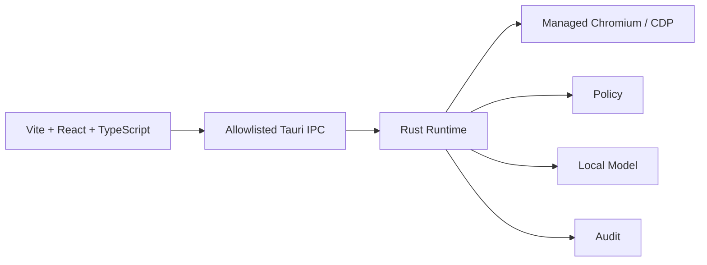
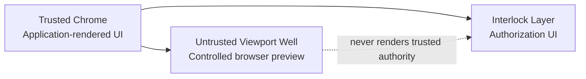
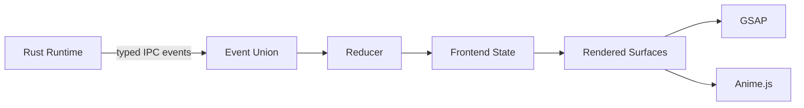
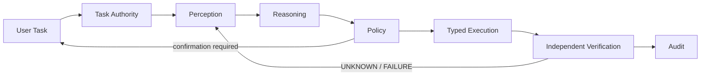
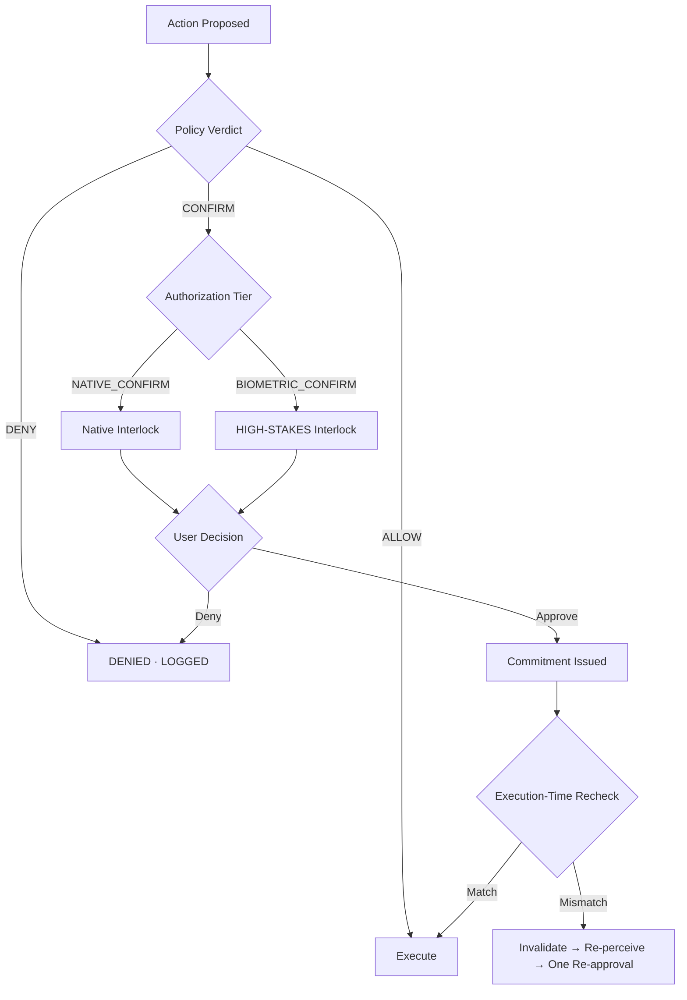
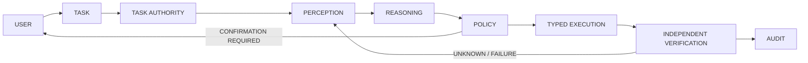

# DESIGN.md — Browser Agent Console

**Status:** Revision 1 · Binding frontend design specification  
**Runtime:** Tauri + Rust + managed Chromium  
**Frontend:** Vite + React + TypeScript  
**Styling:** Tailwind + local design tokens  
**Motion:** GSAP + Anime.js  
**Components:** shadcn + Watermelon UI as editable copy-in sources  
**Pairs with:** `catalog/constraints.yaml` v2.1 and the UI-facing catalog addendum

---

## 0. What this document is for

Browser Agent is a **local, autonomous browser agent** running as a macOS desktop application. The frontend is the supervisory console over a machine that operates managed Chromium, reasons locally, applies trusted Policy, performs typed browser actions, verifies outcomes independently, and records an audit trail.

This is not a SaaS UI and must not visually resemble one.

Every meaningful screen value corresponds to a real runtime entity: task authority, task progress, epoch, action class, authorization tier, Policy verdict, taint flow, skill version, target/frame/loader, verification outcome, audit state, model state, network state, or intervention state.

**If the runtime does not emit it, the frontend does not invent it.**

The UI exists to answer four questions:

1. What is the machine doing?
2. What is it about to do?
3. Is it allowed to do it?
4. What actually happened?

---

# 1. Product reality

## This is

A single-user, local-first operations console. The user owns the machine, local runtime, model, credentials, browser state, and audit trail.

## This is not

There is no:

- account system;
- team/workspace model;
- pricing;
- subscriptions;
- billing;
- payment option;
- cloud dashboard;
- growth funnel;
- engagement metric;
- invite flow;
- SaaS usage meter;
- landing page inside the product;
- marketing surface;
- upgrade prompt.

The application opens directly into the operational console.

---

# 2. Design thesis

The correct metaphor is an **industrial control panel**, not a website and not a chatbot.

The interface should communicate:

- control;
- state;
- provenance;
- precision;
- restraint;
- locality;
- trust boundaries.

It should feel closer to a serious operations, browser-debugging, or security instrument than a startup dashboard.

### Design laws

**States are explicit.** A value is known, unknown, unavailable, or not emitted. The UI never invents certainty.

**Interlocks are real.** HIGH_STAKES authorization is a visibly distinct safety interlock.

**Every indicator is wired.** A status field without a runtime source is invalid.

**Density is intentional.** Compact tables, technical labels, timestamps, hashes, epochs, and monospaced values are the truthful format for this product.

---

# 3. Absolute visual rules

## Never use

- emojis;
- Lucide or any decorative icon library;
- icon-only controls;
- gradients of any kind;
- glassmorphism;
- backdrop blur;
- glow effects;
- large rounded cards;
- `border-radius` above 2px;
- drop shadows;
- elevation systems;
- generic SaaS dashboards;
- hero sections;
- feature grids;
- testimonials;
- mascots;
- AI badges;
- fake activity feeds;
- notification bells;
- unread engagement badges;
- skeleton loaders;
- shimmer;
- spinners without state labels;
- fabricated progress bars;
- seeded demo values in live surfaces;
- optimistic Policy/verification/security UI;
- `OK` / `Cancel` labels;
- runtime Google Fonts or CDN assets;
- chat-thread UI;
- chatbot personas;
- visible macOS Command glyphs in chrome;
- decorative shortcut chips;
- fake green online dots;
- the words `Live now` and `fallback` in UI copy;
- marketing language.

## Do use

- hard-edged surfaces;
- 1px rules;
- rectangular controls;
- strong typography;
- technical data presentation;
- restrained semantic color;
- backend-driven state;
- event-driven updates;
- quiet, purposeful motion;
- dense tables where the data warrants them;
- negative space only when it improves comprehension.

---

# 4. Stack decision

## 4.1 Vite + React + TypeScript

The frontend uses **Vite + React + TypeScript**.

Next.js static export is explicitly superseded by ADR-009.

Reason: this is a local, event-driven desktop console. It has no SEO requirement, no SSR requirement, no web hosting requirement, and no need for a server-side Next.js runtime. Vite keeps the frontend dependency surface smaller and better aligned with Tauri.

## 4.2 Tauri

Tauri remains the desktop runtime and security boundary.

The frontend is a local application bundled into Tauri. It communicates with Rust through the existing allowlisted IPC layer.



No public HTTP API is introduced simply to support the frontend.

## 4.3 Styling

Use Tailwind and centralized CSS variables. Design tokens in this document are the only source of truth for visual values.

## 4.4 Component sources

Use shadcn and Watermelon UI as **editable copy-in sources**, never as installed themes.

Vendor selected components into the repository, retain their licenses, and harden them to this design system.

If a component cannot survive the rules in this document, rebuild it locally.

---

# 5. Typography

Use only locally bundled fonts.

### UI

**IBM Plex Sans**

### Data

**IBM Plex Mono**

Do not use:

- Inter;
- Roboto;
- Geist;
- remote webfonts;
- Google Fonts;
- CDN font assets.

## Type tokens

| Token | Value | Use |
|---|---|---|
| `font-ui` | IBM Plex Sans 400/500/600 | Interface text |
| `font-data` | IBM Plex Mono 400/500 | Runtime values |
| `type-surface-label` | 11px / 600 / uppercase / +0.08em | Surface labels |
| `type-section` | 13px / 600 | Section headers |
| `type-body` | 13px / 400 | Descriptions |
| `type-data` | 12.5px / 400 mono | Tables and values |
| `type-metric` | 20px / 500 mono | Large readouts |
| `type-micro` | 11px / 400 / +0.04em | Annotations |

Minimum rendered size: **12px**.

### Security values

All security-sensitive values render with `font-data`:

- amounts;
- origins;
- recipients;
- account identifiers;
- hashes;
- epochs;
- commitment IDs;
- timestamps.

The frontend does not transform security strings. Punycode, bidi stripping, normalization, and other security display preparation happen in Rust.

---

# 6. Color

Single theme: **dark console**.

There is no light theme.

```text
bg-0          #0E0F10
bg-1          #141517
bg-2          #1A1C1F
bg-3          #22252A

line          #2E3238
line-strong   #3E434B

text-0        #E8EAED
text-1        #A8ADB5
text-2        #6E747D

sem-verified  #3FB950
sem-caution   #D29922
sem-violation #F85149
```

Semantic rules:

| Token | Meaning |
|---|---|
| `sem-verified` | `VERIFIED_SUCCESS` only |
| `sem-caution` | confirmation, HIGH_STAKES, parked, expiring |
| `sem-violation` | denied, failed, blocked, tampered, fail-closed |

`LIKELY_SUCCESS` never receives verified-green treatment.

## UNKNOWN

UNKNOWN is deliberately **not a hue**.

Use:

- `text-1`;
- `bg-3`;
- 1px dashed `line-strong` border;
- literal `UNKNOWN` label.

Unknown represents insufficient knowledge.

## Focus

Every focusable element gets:

```text
2px solid #FFFFFF outline
1px offset
```

No exceptions.

---

# 7. Geometry

- Base unit: 4px.
- Spacing: 4 / 8 / 12 / 16 / 24 / 32.
- Default `border-radius: 0`.
- Maximum tolerated radius: 2px.
- No shadows.
- No elevation system.
- Separation comes from rules and background steps.
- Minimum window: 1024×720.
- Intended working width: 1200px+.

Do not create mobile-card layouts or responsive SaaS breakpoints.

---

# 8. Trust-based spatial architecture

The window is divided by trust, not by decorative layout.



## Trusted chrome

Everything the application renders:

- status spine;
- navigation rail;
- task console;
- Policy;
- evidence;
- settings;
- dialogs.

## Untrusted viewport well

Page-controlled content appears here and only here.

A hostile page may draw a fake confirmation in this region. That does not become trusted UI.

## Interlock layer

Authorization dialogs live outside the untrusted browser preview and are visually distinct.

---

# 9. Global layout

The primary workspace may use up to three operational zones:

```text
┌───────────────────────────────────────────────────────────────────┐
│ STATUS SPINE                                                     │
├─────────────────┬────────────────────────────┬────────────────────┤
│ CONTROL / TASK  │ CONTROLLED BROWSER STATE  │ EVIDENCE           │
│                 │                            │                    │
│                 │                            │                    │
├─────────────────┴────────────────────────────┴────────────────────┤
│ EVENT STREAM / RUNTIME STATUS                                    │
└───────────────────────────────────────────────────────────────────┘
```

Do not force three columns onto every surface.

---

# 10. Status spine

The top status spine is permanently visible.

Suggested runtime bindings:

| Element | Display |
|---|---|
| App identity | `AGENT` + surface context |
| Abort | `ABORT` |
| Egress | backend-issued egress state |
| Model | model ID + load/residency state |
| High-risk process | `0/1` or `1/1` + queue |
| Audit | chain verification state |
| Task | current task state + step |

Example:

```text
EGRESS: ENFORCED
MODEL: QWEN3-1.7B · VERIFIED · LOADED
HIGH-RISK: 1/1
AUDIT: CHAIN VERIFIED
TASK: RUNNING · STEP 4/11
```

Every status field is wired to backend state.

## ABORT

`ABORT` is always reachable.

Its flow is:

```text
backend stop
→ preserve safe state
→ STOPPED
```

No confirmation dialog is required for abort.

---

# 11. Navigation rail

Text only. No icons.

Order:

```text
CONSOLE
INTERVENTION
POLICY
SKILLS
AUDIT
VAULT
MODEL
NETWORK
QUARANTINE
PROFILES
SETTINGS
```

A parked task can show:

```text
1 PARKED
```

No dot-only indicators.

---

# 12. Frontend state model

The frontend is a projection of the typed Rust event stream.



Rules:

1. Every security-relevant renderable state must exist in backend state/event definitions.
2. No optimistic Policy, verification, authorization, or security state.
3. Backend timestamps are canonical.
4. Countdown rendering uses backend-issued expiry instants.
5. Verification categories render exactly.
6. Local state is limited to presentation state.

The frontend may own:

- panel open/closed;
- sort order;
- selected row;
- visual preferences.

The frontend never owns:

- Policy;
- authorization tier;
- verification;
- task authority;
- secrets;
- browser truth;
- security decisions.

---

# 13. Core runtime visualization



The UI can visualize these transitions, but it must animate **actual backend state changes** rather than a fake AI workflow.

---

# 14. Screen inventory

The product contains operational screens only.

## 14.1 CONSOLE

Main operational surface.

### Task Composer

One multiline input.

Placeholder:

`Describe the task.`

Action:

`SUBMIT TASK`

Not chat.

No conversation thread, persona, suggested prompts, mascot, or AI greeting.

### Authority Review

After submission:

- task authority;
- normalized goal;
- sites;
- items;
- constraints;
- capabilities required;
- projected risk/classification.

Controls:

```text
BEGIN TASK
REVISE
```

### Progress Object

Render the orchestrator's actual typed progress object.

Example:

```text
STEP 4/11
EPOCH 37
MODE: DETERMINISTIC SKILL
```

Possible backend states:

```text
PENDING
RUNNING
VERIFIED
LIKELY_SUCCESS
UNKNOWN
FAILED
ABORTED
```

### Action Ledger

Dense table:

| TIME | EPOCH | TARGET | ACTION | CLASS | TIER | POLICY | EXEC | VERIFY |
|---|---|---|---|---|---|---|---|---|

Row selection opens an evidence drawer containing the backend's full target/frame/loader identity, Policy inputs, hit-test information, verification evidence, and commitment when present.

### Live Perception

Show actual state graph information:

```text
NODES
FRAMES
RELEVANT MUTATIONS
NOISE MUTATIONS
STABILIZATION
LIVELOCK
```

No fake metrics.

---

## 14.2 BROWSER PREVIEW

The browser preview is a **readout**, not a second browser.

Render only backend-provided screenshots or controlled state representations.

Never inject untrusted page HTML into the frontend webview.

### Trust strip

Show:

```text
ORIGIN
EPOCH
LOADER
FRAMES
PROCESS CLASS
```

Example:

```text
example.com
EPOCH 41
LOADER 93B2
FRAMES 4 / 1 OOPIF
HIGH-RISK PROCESS
```

The preview cannot become the authorization surface.

---

## 14.3 INTERVENTION

For CAPTCHA, 2FA, passkeys, and explicit human checkpoints.

Show:

```text
USER INTERVENTION
CAPTCHA REQUIRES USER ACTION
HANDED TO USER
02:41 REMAINING
```

Expiry is backend-issued.

Resume is explicit:

`RESUME TASK`

Backend then performs fresh-epoch re-perception.

Never silently continue.

Never call this a "fallback".

---

## 14.4 POLICY

### Decision log

Show:

- action;
- class;
- authorization tier;
- verdict;
- evaluated inputs;
- reason.

### Credential scopes

Show actual typed scope objects.

### Taint / provenance

Render dataflow as:

```text
SOURCE → SINK → VERDICT
```

This surface should look like a dataflow instrument, not a dashboard card grid.

---

## 14.5 SKILLS

Table:

```text
ID
VERSION
ORIGIN SCOPE
STATUS
COMMITMENT HASH
LAST SHADOW EVAL
```

Typical runtime statuses:

```text
ACTIVE
SHADOW
SUSPENDED — DRIFT
REVOKED
```

Suspended skills can expose:

```text
REQUIRES USER APPROVAL
APPROVE RE-PROMOTION
```

Approval creates a new immutable version; the UI then displays the new version ID and commitment hash from the backend.

---

## 14.6 AUDIT

Forensic presentation.

Show:

```text
SEGMENT
EVENT COUNT
HMAC CHAIN STATE
```

Actions:

```text
VERIFY CHAIN
EXPORT SIGNED
```

Results must be explicit:

```text
VERIFIED <timestamp>
```

or:

```text
TAMPER DETECTED AT EVENT <n>
```

---

## 14.7 VAULT

Show metadata only:

- origin;
- account label;
- scope;
- HTTPS check state;
- IDN/homograph check state;
- last-used task.

Secrets never cross into the frontend.

Same-origin conflicts should render:

```text
AMBIGUOUS
TASK AUTHORITY MUST DISAMBIGUATE
```

Never expose page-controlled credentials as an arbitrary picker.

---

## 14.8 MODEL

Expose the real model artifact state.

```text
MODEL
Qwen3 1.7B

QUANTIZATION
Q4_K_M

SHA-256
<full backend value>

VERIFIED AT LOAD
...

RESIDENCY
LOADED / PARKED

INFERENCE
p50 / p95

SCHEMA-VALID
...

SEMANTICALLY-CORRECT
...
```

Do not introduce "smart mode", "AI power", or other synthetic intelligence ratings.

---

## 14.9 NETWORK

Expose:

```text
EGRESS MODE
DESTINATIONS
REQUEST CLASSIFICATION
CORRELATION
REDIRECTS
QUIC
DOH
```

Examples:

```text
EGRESS: ENFORCED
QUIC: BLOCKED
DOH: DISABLED
```

Correlation failures must be shown as:

```text
CORRELATION MISS — DENIED
```

---

## 14.10 QUARANTINE

Downloads are never automatically opened.

Show:

```text
FILE
SIZE
TYPE
VERIFICATION
```

Actions:

`VERIFY`

Then, if permitted by the backend:

`REVEAL IN FINDER`

The quarantine surface exists so verified downloads do not become a black hole.

---

## 14.11 PROFILES

Show high-risk profile lifecycle.

Ephemeral:

```text
EPHEMERAL
REMAINING LIFE
```

Persistent opt-in:

```text
EXPIRES
STORAGE USED / CAP
PURGE
```

Purge is immediate and audited.

---

## 14.12 SETTINGS

Local runtime settings only.

Sections:

```text
RUNTIME
BROWSER
MODEL
NETWORK
VAULT
SECURITY
AUDIT
NOTIFICATIONS
KEYBOARD
```

No account, billing, subscription, workspace, team, or cloud-sync settings.

Security-critical undefined parameters must not receive frontend-authored defaults.

---

## 14.13 STOPPED / RECOVERY

Hard-stop surface:

```text
SAFE STOP

REASON
<backend reason>

TASK
<task>

STATE PRESERVED
<backend summary>

RESUME
EXPLICIT
```

Stale commitments and epochs must be shown as invalidated when the backend says so.

No silent continuation.

---

# 15. Authorization interlock

This is the most important visual surface.

It is not a generic component-library modal.

Use:

- `bg-1`;
- hard border;
- zero/near-zero corner radius;
- no blur;
- flat dark scrim;
- visually distinct geometry;
- stable content from first frame.



## Fixed content order

### 1. Tier header

Ordinary:

`AUTHORIZATION REQUIRED`

High-stakes:

`HIGH-STAKES AUTHORIZATION`

High-stakes must be structurally more prominent, not merely recolored.

### 2. Trusted fields

Backend-composed and monospaced:

- origin;
- action class;
- amount;
- destination/recipient;
- data-flow summary;
- evidence tier.

### 3. Quarantined page-derived zone

Page-derived strings appear separately:

```text
UNVERIFIED — REPORTED BY PAGE
```

Trusted and untrusted content are never interleaved.

### 4. Typed confirmation

For payments and financial transfers inside HIGH_STAKES, re-enter the amount or recipient characters exactly as the backend provides them.

Show:

```text
MATCH
```

or:

```text
MISMATCH
```

### 5. Consequence-specific controls

Use:

```text
CONFIRM PURCHASE — ₹12,500.00
DENY AND STOP TASK
```

Never:

```text
OK
Cancel
Yes
No
```

Escape means deny.

Clicking the scrim does nothing.

---

# 16. Motion system

GSAP and Anime.js are both required.

## GSAP owns

- surface transitions;
- panel entry/exit;
- drawers;
- structural workspace transitions;
- intervention transitions;
- recovery transitions.

## Anime.js owns

- small non-security value changes;
- status ticks;
- restrained data emphasis;
- local micro-interactions.

Do not animate the same property with both libraries.

## Motion laws

1. Motion exists only when runtime state changes.
2. Security content never animates.
3. Amounts, origins, recipients, tiers, verdicts, hashes, and evidence values never morph, count, tween, or interpolate.
4. No parallax.
5. No scroll choreography.
6. No ambient particle effects.
7. No celebration animations.
8. No AI sparkle.
9. Waiting states show truthful latency rather than fake progress.
10. `prefers-reduced-motion` disables animation while preserving state visibility.

Suggested timing ranges:

```text
micro       100–180ms
state       180–320ms
panel       250–450ms
major       350–650ms
```

---

# 17. Notifications

Notifications are runtime events, not an inbox.

No:

- bell icon;
- unread badge;
- marketing notification;
- digest;
- re-engagement notification.

Native macOS notifications are limited to:

- human checkpoint required;
- task parked;
- task approaching expiry;
- hard stop;
- critical irreversible verification outcome;
- egress mode change;
- audit-chain tamper detection.

Clicking a notification focuses the relevant surface/entity.

---

# 18. Copy rules

Operational voice.

Present tense.

No personality.

Avoid:

```text
seamless
empower
effortless
smart
intelligent
supercharge
unlock
revolutionize
magic
powerful
powered by
let's
oops
whoops
something went wrong
```

No exclamation marks.

### Good

```text
UNKNOWN
Independent verification is incomplete.
```

```text
SAFE_ABORT
Execution stopped after a stale state was detected.
```

```text
REQUEST_CONFIRMATION
Trusted Policy requires approval before execution.
```

```text
HIGH_STAKES
Fresh biometric confirmation required.
```

### Bad

```text
Oops!
Something went wrong.
Your AI got confused.
```

All system-state copy comes from backend payloads.

Static frontend strings are limited to:

- surface labels;
- column headers;
- control verbs;
- precise vocabulary definitions.

---

# 19. Accessibility

Implement:

- semantic HTML;
- full keyboard operability;
- visible focus;
- WCAG AA minimum;
- AAA target on data readouts;
- color-independent meaning;
- reduced-motion support;
- stable focus in dialogs;
- polite live-region updates for operational state.

Do not decorate controls with macOS Command glyphs.

Keyboard access remains fully functional without shortcut chips.

---

# 20. Performance and lazy loading

The webview contributes to the application's unified-memory budget.

Targets:

```text
Steady-state JS heap: ≤150 MB
Alert threshold: >200 MB
Initial surface JS bundle: ≤350 KB gzipped
```

## Required

- code-split large surfaces;
- lazy-load heavy panels;
- virtualize every list over 100 rows;
- release browser preview resources when hidden;
- decode screenshots on demand;
- do not hold screenshot sequences in memory;
- subscribe to backend events;
- avoid polling;
- throttle non-critical visual updates;
- avoid unnecessary React renders.

Lazy loading must never hide or delay a security-critical confirmation or hard-stop surface.

Initial shell should load only what is needed for:

- task composer;
- essential task state;
- status spine;
- essential notifications.

Lazy-load heavier surfaces such as audit analysis, trace exploration, model diagnostics, benchmark/diagnostic views, and large evidence inspectors.

---

# 21. Component sourcing

shadcn and Watermelon UI are source material, not the visual identity.

Process:

1. Copy useful primitives into the repository.
2. Preserve source licenses.
3. Remove rounded variants.
4. Remove shadows.
5. Remove gradient utilities.
6. Remove decorative icon slots.
7. Apply Browser Agent design tokens.
8. Re-review each component against this file.

A library default never overrides this design contract.

---

# 22. Frontend / backend ownership

| Frontend owns | Backend owns |
|---|---|
| layout | task state |
| rendering | Policy |
| event reduction | authorization tier |
| animation timing | verification |
| list virtualization | epochs |
| focus management | amounts |
| presentation-only local state | origins |
| sort/collapse/selection | recipients |
| visual preferences | timestamps |
| | classifications |
| | reasons |
| | expiry |
| | browser truth |
| | security decisions |
| | secrets |

The frontend never:

- calculates Policy;
- calculates authorization tier;
- formats security strings;
- performs verification;
- handles secret values;
- invents runtime state.

---

# 23. Backend-driven screen contract

Every screen should identify which runtime values it consumes.

Example:

```text
CONSOLE
  task.id
  task.authority
  task.progress
  task.current_state
  task.epoch

POLICY
  action.side_effect_class
  authorization.tier
  authorization.decision
  authorization.reason

VERIFICATION
  outcome
  evidence[]
  postconditions[]
  timestamp

INTERVENTION
  type
  reason
  expiry
  resume_state

NETWORK
  egress.mode
  destination.classification
  correlation.result

MODEL
  manifest
  hash
  residency
  latency
  schema_valid_rate
  semantic_correct_rate
```

When a backend field is absent, the frontend must not fabricate a replacement value.

---

# 24. Prohibited frontend patterns

The implementation agent must reject:

```text
SaaS dashboard
pricing page
billing page
upgrade banner
team page
invite modal
landing page
feature hero
customer logos
testimonials
marketing statistics
AI sparkle
AI avatar
gradient hero
glass card
rounded dashboard
emoji
Lucide icon
icon-only button
macOS Command glyph
shortcut pill
fake green online dot
fake notification count
generic toast spam
placeholder backend values
client-side Policy
client-side authorization tier
client-side verification
"fallback" in user-facing copy
```

---

# 25. Visual quality test

The UI is correct when:

- it feels like a serious local instrument;
- the task is central;
- runtime state is visible;
- Policy is inspectable;
- evidence is inspectable;
- intervention is obvious;
- security states cannot be missed;
- animation explains change;
- nothing decorative moves without reason;
- it does not resemble a SaaS template;
- there are no marketing surfaces;
- exact backend terminology is preserved;
- the user can understand what happened without trusting the model.

The correct aesthetic is **deliberate software**, not AI-generated software.

---

# 26. Frontend review gates

These are design enforcement checks. They do not replace the security catalog.

- [ ] Zero emoji matches in `src/`.
- [ ] Zero gradient utilities in classnames/styles.
- [ ] Maximum `border-radius` ≤ 2px.
- [ ] No icon-library imports.
- [ ] No runtime font/CDN fetches.
- [ ] No `OK` / `Cancel` button labels.
- [ ] Security strings use `font-data`.
- [ ] Security strings are rendered without client transformation.
- [ ] Interlock security content has no animation.
- [ ] Verification categories render in full.
- [ ] `LIKELY_SUCCESS` never receives verified-green styling.
- [ ] Lists over 100 rows are virtualized.
- [ ] Every status-spine field maps to a runtime source.
- [ ] Untrusted browser content never renders trusted authority.
- [ ] Re-promotion, quarantine reveal, and profile purge are visible and wired where backend support exists.
- [ ] `prefers-reduced-motion` is honored globally.
- [ ] Screen inventory matches this document.
- [ ] Frontend does not calculate Policy.
- [ ] Frontend does not calculate authorization tier.
- [ ] Frontend does not generate security timestamps.
- [ ] Frontend cannot receive raw secret values through IPC.
- [ ] No invented backend state strings exist in operational surfaces.
- [ ] No fake seeded runtime data exists.

---

# 27. Final implementation rule

Build the interface around the actual machine:



Do not build a marketing layer around the runtime.

Do not invent a personality for the agent.

Do not hide Policy, evidence, or uncertainty behind decorative UI.

Do not make the application look like a SaaS product.

The interface should expose the machine's real state, in the machine's real vocabulary, with nothing invented.
