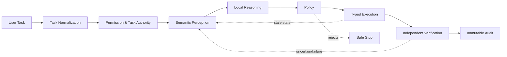
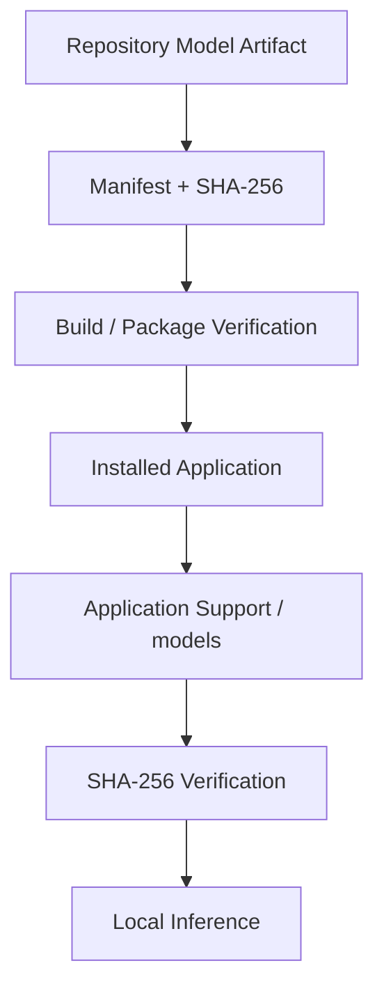
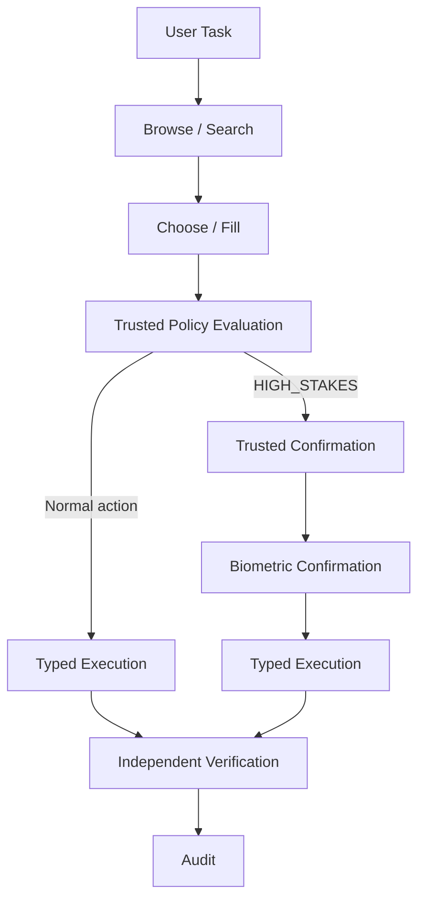
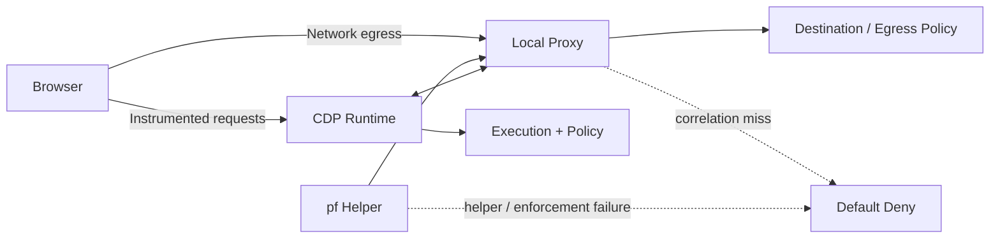
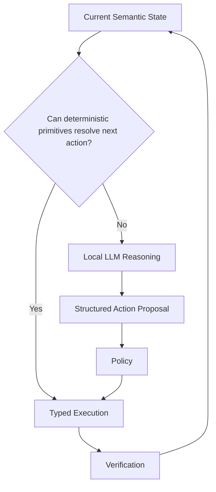
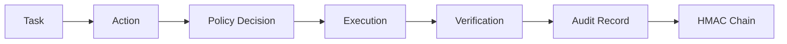
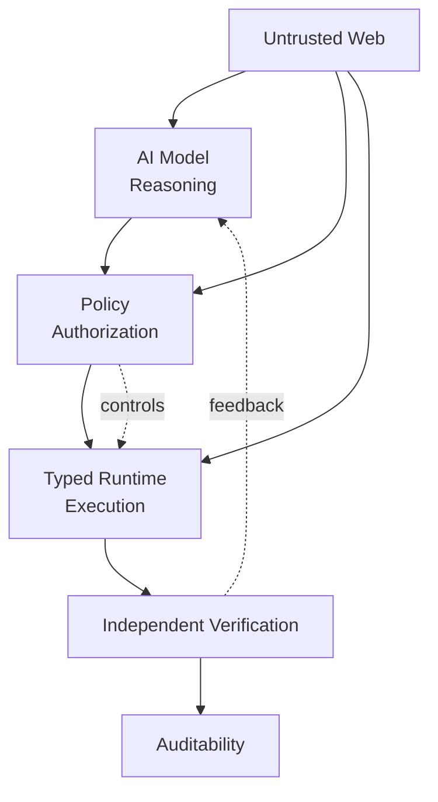

# Browser Agent

> **An open-source, local-first browser agent built for controlled autonomous web tasks.**

[](LICENSE)
[](https://www.rust-lang.org/)
[](https://tauri.app/)

Browser Agent is a local browser automation runtime built around **Rust, Tauri, Chromium CDP, typed actions, policy-driven authorization, independent verification, and local LLM reasoning**.

The core idea is simple:

> **The model proposes. Trusted runtime components decide, execute, and verify.**

---

## ⚠️ Status

**Experimental / early development.**

Browser Agent is **not production-ready** and should not be trusted with real financial transactions, sensitive credentials, confidential documents, or other high-stakes actions.

The project is designed with explicit security and verification boundaries, but code existing in the repository does not by itself mean those boundaries have passed their required evidence gates.

---

## Why Browser Agent?

Most browser agents collapse several responsibilities into one loop: observe a page, ask a model what to do, perform the action, and trust the result.

Browser Agent separates those responsibilities.



This separation is important because the browser can change underneath the agent, webpages can be hostile, and some actions have real-world consequences.

---

## Design Principles

### Local-first

The primary reasoning path runs locally using a repository-controlled GGUF model with `llama.cpp` and Metal.

The application must not download models at runtime from external model providers.



### Typed actions only

The model has a narrow, typed execution surface:

```text
NAVIGATE
CLICK
TYPE
SELECT
SCROLL
WAIT
PRESS_KEY
SECURE_FILL
REQUEST_CONFIRMATION
```

Arbitrary model-controlled JavaScript execution is prohibited.

Actions are bound to the browser state epoch from which they were derived. If relevant state changes before execution, stale actions are rejected instead of being blindly replayed.

### Policy is separate from the model

Side effects and authorization are treated as separate concepts.

**Side-effect classes**

```text
READ
REVERSIBLE_WRITE
IRREVERSIBLE
UNKNOWN → IRREVERSIBLE
```

These classes drive retry, idempotency, and execution strictness.

Authorization is independently derived by trusted Policy using information such as:

- side-effect class
- destination
- taint
- data flow
- task authority
- amount
- security/account context

The model cannot choose its own authorization tier. It may only emit:

```text
REQUEST_CONFIRMATION
```

Policy decides what confirmation is required.

---

## High-Stakes Authorization

Biometric confirmation is **not** used for every irreversible action.

Fresh biometric authorization is reserved for defined **HIGH_STAKES** actions such as:

- payments
- financial transfers
- important sensitive decisions
- defined sensitive outbound transmission/publication

Ordinary browsing, typing, login navigation, secure fill, reversible actions, and routine execution do not automatically invoke biometrics.



The model remains unaware of the biometric mechanism.

Approval commitments include the authorization tier. A tier mismatch at execution time invalidates the commitment and requires the appropriate re-approval path.

---

## Security Model

### Web content is untrusted

Everything originating from a webpage is treated as untrusted input, including:

- HTML
- JavaScript
- DOM text
- accessibility information
- page messages
- clipboard data
- files
- URLs and deep-link parameters
- network responses
- content reflected into model reasoning

Page-controlled content cannot redefine task authority, Policy, authorization tier, credential scope, or trusted confirmation.

Prompt injection is therefore handled as an **untrusted-input problem**, not as a trusted instruction channel.

### Secrets stay out of model context

Raw secrets must never enter model context or ordinary verification evidence.

This includes passwords, cookies, authentication headers, tokens, and credential values.

`SECURE_FILL` is a trusted runtime primitive rather than ordinary model-controlled typing.

### Independent verification

Browser Agent does not consider a task successful because the model says it succeeded.

Verification uses independent evidence and can produce:

```text
VERIFIED_SUCCESS
LIKELY_SUCCESS
UNKNOWN
LIKELY_FAILURE
VERIFIED_FAILURE
```

Evidence can include browser lifecycle state, DOM/accessibility state, target/frame/loader state, network evidence, trusted runtime state, out-of-band evidence, and validated download information.

Page-controlled success banners and model self-reports are not treated as independent truth.

---

## Browser Runtime

Browser Agent uses managed Chromium through the Chrome DevTools Protocol.

The preferred implementation is `chromiumoxide`, with a raw-CDP escape hatch where required.

The runtime is designed around:

```text
--remote-debugging-pipe
```

rather than exposing a TCP debugging endpoint.

Runtime controls include:

- browser process management
- target/session/frame tracking
- loader tracking
- execution-context tracking
- popup/new-tab handling
- OOPIF support
- detached-target recovery
- permissions
- download quarantine
- watchdogs
- safe termination
- Chromium sandboxing and site isolation

### Browser profiles

High-risk profiles are **ephemeral by default**.

Persistent per-site profiles require explicit opt-in and are subject to expiry, storage limits, and user purge.

---

## Network Security

The proxy is a **destination / egress control layer**, not a trusted HTTPS body-inspection mechanism.

Browser instrumentation remains responsible for understanding browser actions and their semantics.

The network layer includes:

- canonical request representation
- CDP ↔ proxy correlation
- request classification
- mutation interception
- passive observation
- default-deny on correlation failure
- proxy-death fail-closed behavior
- QUIC / UDP 443 controls
- DoH controls
- certificate-chain validation
- `pf` enforcement

Unexpected network traffic is treated as a first-class security signal.



---

## Semantic Browser Perception

The perception system reasons about semantic browser targets rather than relying solely on brittle selectors.

It includes:

- DOM extraction
- accessibility extraction
- frame and OOPIF aggregation
- open shadow DOM handling
- geometry and visibility analysis
- actionability filtering
- mutation relevance
- semantic compression
- semantic state graphs
- Unicode normalization
- zero-width / bidi / mixed-script detection
- homoglyph defenses
- target ambiguity detection
- semantic references
- stabilization
- livelock detection
- fallback perception modes
- recursive OOPIF hit testing

The system can reject an ambiguous or stale target instead of guessing.

---

## Local Model

The initial local model artifact is:

**Qwen3 1.7B — Q4_K_M GGUF**

Repository location:

```text
models/
└── provisional/
    └── qwen3-1.7b/
        └── Qwen3-1.7B-Q4_K_M.gguf
```

The model is referenced by a manifest containing its identity, quantization, runtime requirements, and SHA-256 hash.

The running application ultimately loads its installed copy from:

```text
~/Library/Application Support/<app>/models/
```

There is intentionally no runtime model downloader.

---

## Reasoning

The initial architecture supports a deterministic reasoning baseline and is designed to move toward **uncertainty-triggered reasoning**.

The system should not require an LLM call when the next action is already safely resolved.

Reasoning can be triggered by conditions such as:

- target-resolution failure
- ambiguity
- unexpected state
- failed invariant
- unresolved parameter
- contradictory state
- Policy clarification
- recovery mode



---

## Skills & Macros

Browser Agent supports immutable skills and macros built around semantic commitments rather than brittle DOM fingerprints.

Skills can be bound to:

- origin scope
- semantic roles
- required fields
- relationships
- preconditions
- postconditions
- invariants
- Policy requirements

Material site drift can suspend a skill. Critical security defects can trigger immediate revocation.

Skill memory is intentionally structural and must not become an uncontrolled store of credentials, secrets, token-bearing URLs, or arbitrary page content.

---

## Auditability

Important runtime events are recorded through an encrypted, append-only audit system with:

- HMAC chaining
- rotated segments
- redaction
- access control
- export
- local verification
- signed export

The audit trail is intended to make important decisions explainable without storing raw secrets.



---

## Repository Layout

```text
browser-agent/
├── catalog/          # Machine-readable constraints and generated catalog
├── docs/             # Architecture, security, ADRs and release docs
├── models/           # Model manifests and controlled artifacts
├── src/              # Tauri / React UI
├── src-tauri/        # Rust runtime
├── helper/           # Privileged macOS helper
├── mock-sites/       # Controlled browser environments + injectors
├── bench/            # Benchmarks, traces and analysis
├── tools/            # Catalog, audit, model and release tooling
├── scripts/          # Development / CI scripts
└── .github/          # CI and release workflows
```

### Core Rust subsystems

```text
src-tauri/src/
├── core/
│   ├── orchestrator/
│   ├── perception/
│   ├── reasoning/
│   ├── policy/
│   ├── execution/
│   ├── verification/
│   ├── skills/
│   └── vault/
├── cdp/
├── browser/
├── net/
├── inference/
├── audit/
├── storage/
├── security/
└── app/
```

---

## Constraint Catalog

The machine-readable project contract lives at:

```text
catalog/constraints.yaml
```

The generated human-readable catalog is:

```text
catalog/constraint-catalog-v2.1.md
```

The catalog tracks stable constraint IDs, specification status, verification status, tests, dependencies, amendments, supersession, named Revision-2 constraints, and undefined parameters.

The goal is to make architectural and security requirements enforceable rather than tribal knowledge.

---

## Getting Started

### Requirements

The initial development target is macOS on Apple Silicon.

You will need:

- Rust
- Node.js
- pnpm
- Tauri prerequisites
- Chromium
- a compatible GGUF model artifact
- Git LFS when repository-hosted model artifacts are used

### Clone

```bash
git clone https://github.com/<your-org>/browser-agent.git
cd browser-agent
```

### Install dependencies

```bash
pnpm install
```

### Build

```bash
cargo build
```

### Run the app

```bash
pnpm tauri dev
```

### Verify the model artifact

```bash
shasum -a 256 models/provisional/qwen3-1.7b/Qwen3-1.7B-Q4_K_M.gguf
```

The computed hash must match the corresponding model manifest.

---

## Testing

Rust tests:

```bash
cargo test --workspace
```

Frontend tests:

```bash
pnpm test
```

Catalog validation:

```bash
./scripts/lint-catalog.sh
```

Catalog generation:

```bash
./scripts/generate-catalog.sh
```

Security, browser lifecycle, network, policy, verification, isolation, and recovery tests live under the repository test suites.

---

## Contributing

Contributions are welcome.

For security-sensitive changes:

1. Identify the affected constraint IDs.
2. Add or update tests.
3. Preserve the existing trust boundaries.
4. Do not weaken locked requirements simply to make an implementation pass.
5. Add an ADR for material architectural decisions.
6. Keep generated catalog output synchronized with `catalog/constraints.yaml`.

Changes under `src-tauri/src/core/policy/**` should identify their affected catalog constraints.

---

## Security

Browser Agent is experimental software. Do not use it with real financial accounts, production credentials, confidential documents, or critical infrastructure unless the relevant security requirements have been independently verified for the intended threat model.

For vulnerability reporting, use the repository's configured private security reporting mechanism rather than posting undisclosed vulnerabilities publicly.

---

## License

Browser Agent is licensed under the **Apache License 2.0**.

See [`LICENSE`](LICENSE).

---

## The idea

Browser automation becomes significantly more interesting when the agent is treated less like a macro recorder and more like a controlled runtime.



**The model reasons. The runtime controls. Policy authorizes. Typed execution acts. Verification checks. The audit system records.**
